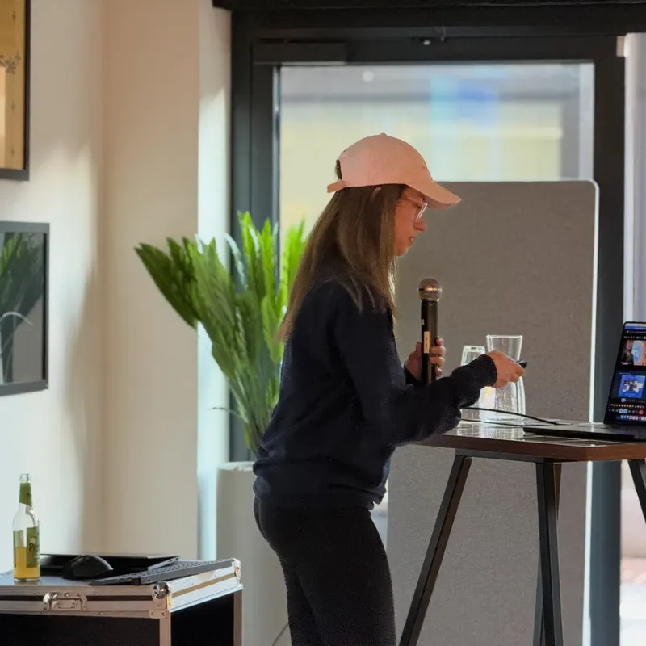
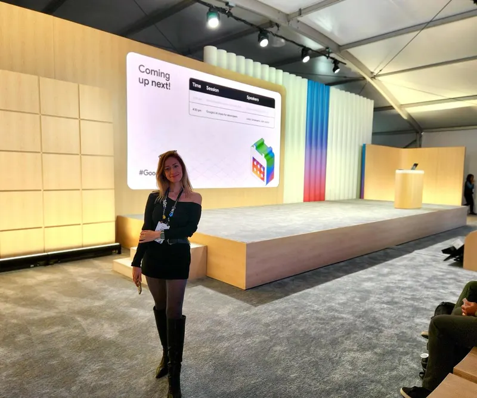
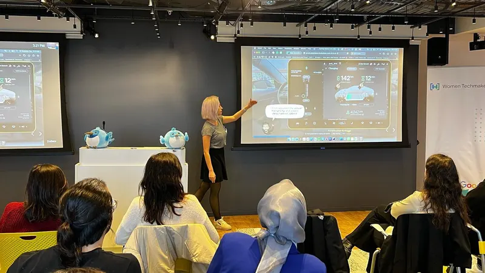

**Senior Flutter & AI Engineer** at [Antigua Mobile](https://github.com/antigua-mobile), Berlin 
**Google Developer Expert** for Flutter & Dart

I build Flutter apps with AI inside, and help other developers do the same. I co-founded and co-host the Flutter Community AI Circle, a bi-weekly Flutter × AI livestream since May 2025, co-authored a Packt book on Flutter design patterns, and give talks and workshops at FlutterCon EU, We Are Developers, DevFests and meetups. I co-organize Flutteristas (including the Flutteristas Conference), Flutter Berlin and DevFest Berlin, and co-lead GDG Cloud Berlin.

### Now

- **7 to 9 Oct 2026** · [next.app devCon / FlutterCon EU](https://www.nextappcon.com/), Berlin · roundtable "Is Flutter a Smart Bet in an AI-Driven Job Market?" with Ivanna Kaceviča (7 Oct), and the Flutter booth
- **11 Nov 2026** · [DevFest Atyrau 2026: From Build to Scale](https://gdg.community.dev/events/details/google-gdg-atyrau-presents-devfest-atyrau-2026-from-build-to-scale/), Kazakhstan · speaker, "SoundStage: She Will Be Loved (by Flutter)", to be confirmed
- **14 Nov 2026** · [DevFest Berlin 2026](https://2026.devfest-berlin.de/), SRH Berlin · co-organizer and website contributor
- **15 Nov 2026** · DevFest Gaziantep, Türkiye · speaker, slot to be confirmed
- **11 Dec 2026** · DevFest Adana, Türkiye · speaker

  
  
  
   
  Flutter Berlin Meetup 2026 · Google I/O 2025 · DevFest Women 2022

### Selected work

- [**Flutter Community AI Circle**](https://esratech.com/fcaic) · every episode, plus the [YouTube playlist](https://www.youtube.com/playlist?list=PL4dBIh1xps-HIYvaEIbLWHZqt_WGBfpx3)
- [**Flutter Design Patterns and Best Practices**](https://github.com/PacktPublishing/Flutter-Design-Patterns-and-Best-Practices) · my book with Packt, co-authored with Daria Orlova and Jaime Blasco, #1 bestseller in category
- [**modemoiselle**](https://modemoiselle.web.app) · a Flutter + Gemini wardrobe app for organizing your closet and putting outfits together (live app, source private)
- [**DevFest Berlin 2026 website**](https://2026.devfest-berlin.de/) · contributor to the community-built event site, Eleventy + Nunjucks ([source](https://github.com/devfest-berlin/2026.devfest.berlin))
- [**patrol-mcp-guide**](https://github.com/esrakadah/patrol-mcp-guide) · AI-driven Flutter UI testing with Patrol and MCP
- [**flutter_voice_bridge**](https://github.com/esrakadah/flutter_voice_bridge) · native platform integration (FFI, Platform Channels) with offline AI transcription
- [**esra-whisper-recorder**](https://github.com/esrakadah/esra-whisper-recorder) · offline CLI voice recorder and transcriber
- Order and stock tooling for a Shopify and Amazon store (Apimaye USA): a Flutter web admin on Firebase, Node.js integrations with the ShipStation and 3PL APIs, and a FedEx shipment-watch Slack bot

### Talks

- **Beyond Chatbots: When AI Owns the Interface** · Flutter Berlin Meetup, 20 Aug 2026
- [**Flutter at Native Speed: The FFI and Platform Channels Way**](https://devfest-berlin-2025.sessionize.com/schedule) · DevFest tour 2025: Berlin, Kocaeli, Istanbul, Edirne, Konya
- [**Flutter Vibes Only**](https://www.youtube.com/watch?v=GiqqJdZaqPk) · vibe-coding workshop series and Groundbreaker mentorship, FlutterCon EU 2025, co-led with Ivanna Kaceviča
- **Bridging the Gap: Extending Flutter Beyond its Limits** · workshop at We Are Developers, Berlin: FFI, isolates and platform views, with an offline Whisper pipeline built live
- [**Flutter & Friends 2024, main stage panel**](https://www.youtube.com/live/7Dx54EZiMAY?t=28122) · Stockholm, moderated by Alek Åström

More talks, workshops and community sessions

- **Beyond Chatbots: Building Agentic Interfaces with Flutter GenUI and A2UI** · Google Cloud Builders Day Berlin 2026
- **AI in Flutter Development: What's Actually Useful?** · roundtable, FlutterCon EU 2025, Berlin
- [**AI Coding Assistants: Where They Can Fit in Your Flutter Development Routine**](https://www.youtube.com/live/ftTXXAx8AxM?t=37625) · Flutteristas Conference
- [**Flutteristas Conference**](https://www.youtube.com/watch?v=9UAOMzl7Nuo) · main organization
- **From Touch To Code: Gestures and Beyond** · FlutterCon Berlin 2024
- **Coding Outside the Box: The Developer's Role in UX and Design Systems** · FlutterCon × droidcon, Berlin 2023
- **Flutteristas Panel** · FlutterCon × droidcon, Berlin 2023
- [**Flutter Design Patterns and Best Practices, the book talk**](https://www.figma.com/slides/rpO5XvxCWa1j0wQn85QQre/) · Flutteristas
- [**Let's Build a Flutter App, Fast!**](https://www.youtube.com/watch?v=lYhBHvyLm6E) · a Flutter + Firebase chat app live in about 40 minutes, at Flutter Ottawa and four more meetups and DevFests (Gaziantep, Edirne, Hitit, Kozhikode)
- [**Cleaner Flutter Code with Dart 3**](https://www.youtube.com/watch?v=pnh3xTR7D70) · Flutter Tel Aviv
- [**Tests in Flutter: Making Sure Your Code Works**](https://www.youtube.com/watch?v=H2OykY1FPb8&t=14435s) · Flutter Festival Turquoise
- [**Takeaways from Flutter Forward 2023**](https://www.youtube.com/watch?v=zoXFggMHCKw) · Google DSC Piri Reis University, in Turkish
- [**Humpday Q&A/AMA with GDE Jhin Lee**](https://www.youtube.com/watch?v=1U-zd6MYrOA&t=877s) · Flutter Community
- [**Humpday Q&A/AMA with Craig Labenz**](https://www.youtube.com/watch?v=HryfB44en0w) · Flutter Community, after Google I/O
- [**Vibe Coding with Norbert**](https://www.youtube.com/watch?v=S01tPLxQiU4) · livestream series building a roguelike deck-builder with AI

Talk abstracts: [Sessionize](https://sessionize.com/esrakadah)

### Writing

- [FCAIC #4: Agentic Apps Hands-On (with a UX Twist!)](https://medium.com/@esrakadah/fcaic-4-agentic-apps-hands-on-with-a-ux-twist-fbc72cbf6859)
- [Flutter & AI: What Really Landed for Developers at Google I/O 2025](https://medium.com/antigua-mobile/flutter-ai-what-really-landed-for-developers-at-google-i-o-2025-d7d91e8f7814)
- [Material 3 Expressive: Rethinking Emotion, Accessibility & Modern UX](https://medium.com/antigua-mobile/material-3-expressive-rethinking-emotion-accessibility-modern-ux-9f4c888d87c9)
- [Flutter x AI from Google I/O Connect Berlin](https://medium.com/@esrakadah/memories-and-updates-covering-flutter-x-ai-from-google-i-o-connect-berlin-2025-b82b137e1933)

---

[esratech.com](https://esratech.com) · [LinkedIn](https://linkedin.com/in/esratech) · [Bluesky](https://bsky.app/profile/esratech.bsky.social) · [X](https://x.com/esratech) · [Instagram](https://www.instagram.com/esra.tech) · [Medium](https://medium.com/@esrakadah) · [Sessionize](https://sessionize.com/esrakadah)
